# Manual Tecnico

Esta aplicacion se creo en lenguaje de programacion C# y se basa en el uso de estructuras de datos avanzadas
para optimizar la organización y consulta de información en el sistema, esto con el fin de mejorar la eficiencia de procesamiento de datos.

## Fronted
El fronted de esta aplicación se codifico en Gtk con C# y esta se divide en varias clases, cada una encargada de cada objeto de las distintas ventanas, las clases creadas para hacer esta aplicación son:
- Ventana
- Botones
- Labels
- CajaTextos
- Combo Box
- Caja de Textos
  
Cada clase se creo con POO para poder disminuir el numero de lineas en el codigo.

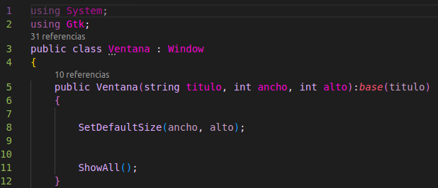

Para crear una ventana con sus distintos componentes se creaba inicialmente una ventana que pedia los datos de *titulo, ancho y largo* en ese orden.

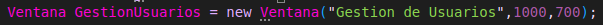

Posteriormente se agregaba los botones, labels y cajas de texto como fueran requeridos segun las exigencias del desarollo. Los labels exigen el texto que llevara y su posición en x e y. Mientras que el botón pide su texto, anchura, altura y posiciones x e y, por ultimo la caja de texto pedía su anchura, altura y sus posiciones en x e y. 

*ejemplo de las invocaciones*
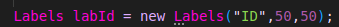
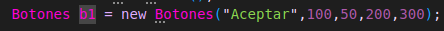
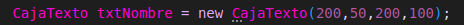

## Backend

El backend se basa en las distintas listas y sus nodos que almacenan la informacion, ademas tambien se implementaron estructuras de arboles binarios para el manejo de los datos.
Entre las listas se encuentran:
- Listas simplemente enlazadas
- Listas doblemente enlazadas
  
 Y entre los arboles se encuetran:
 - Arboles Binarios de busqueda
 - Arboles AVL
 - Arboles B

# Listas simplemente enlazadas
estas listas tienen como nodo la clase **Block.cs** esta almacena los datos de un los **Usuarios**, de esa forma se puede decir que cada nodo es un usuario al crearlos de forma simultanea, ademas para la proteccion de los datos de los usuarios se implemento el uso de Blockchain, este se encarga de encriptar las contrasenas de los usuarios para que sea mas complicado para los hackers obtenerlas.

*imagen del Nodo*

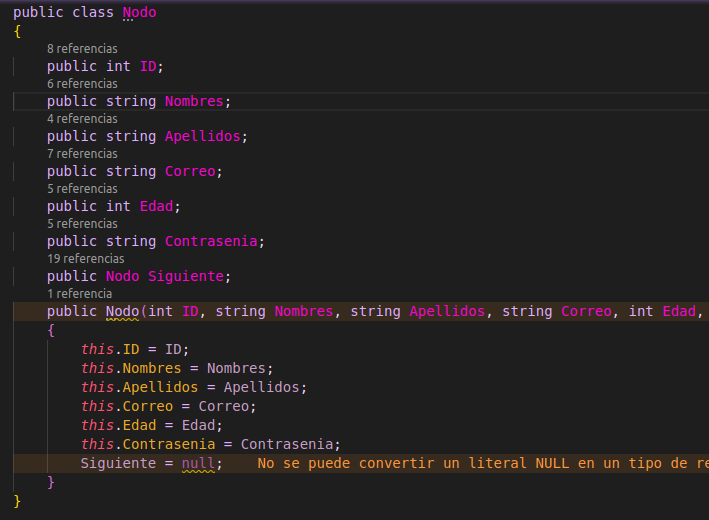

La lista tiene distintas funciones como Insertar() que le permite ingresar datos a la lista.

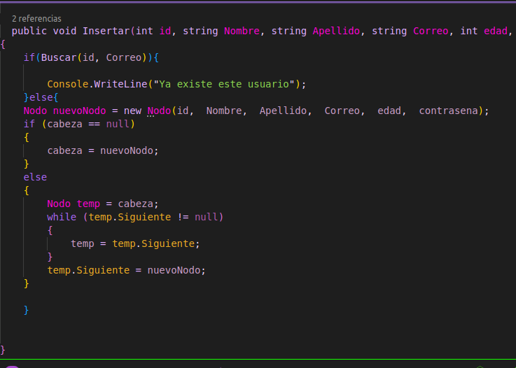

Borrar() que elimina nodos de la lista. 

Buscar que encuentra los distitnos nodos de la lista.

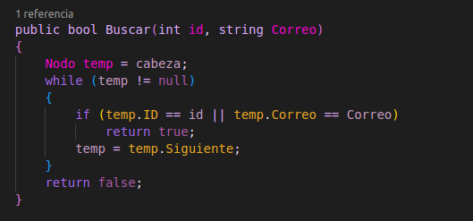

# Lista doblemente enlazada

Estas listas tienen como nodo la clase **NodoD.cs** esta almacena los datos de los datos de los **Vehiculos**, de esa forma se puede decir que cada nodo es un vehiculo al crearlos de forma simultanea.

*imagen del Nodo*

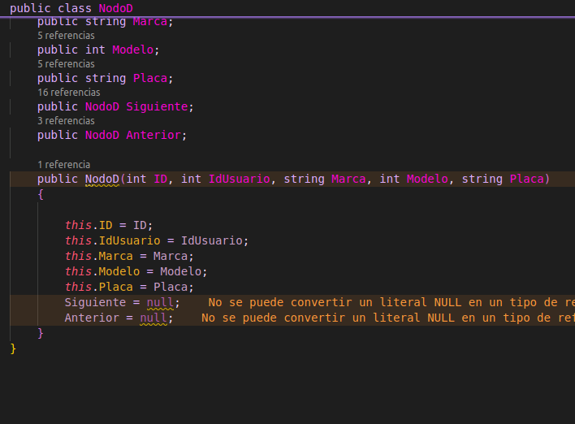

La lista la funcion Insertar() que le permite ingresar datos al final de la lista.

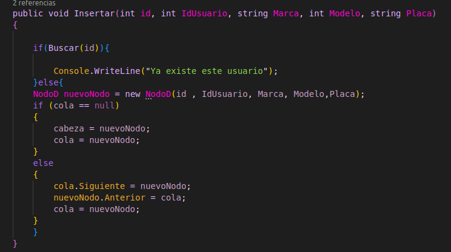

## Arbol Binario de Busqueda

En estas se crearon nodos para poder almacenar los datos de los servicios, al mismo tiempo que servian para generar las ramas que le darian la estructura caracteristica de un arbol.

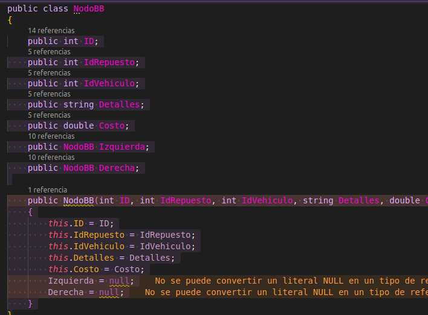
esta estructura de dato se utilizo con el fin de aumentar la velocidad al momento de buscar los datos debido a su estructura de arbol.

## Arbol AVL
En estas se crearon nodos para poder almacenar los datos de los repuestos, al mismo tiempo que servian para generar las ramas que le darian la estructura caracteristica de un arbol.
esta estructura de dato se utilizo con el fin de aumentar la velocidad al momento de buscar los datos debido a su estructura de arbol, ademas gracias a su balanceo tiene mayor eficiencia al momento de trabajar con una mayor cantidad de datos.
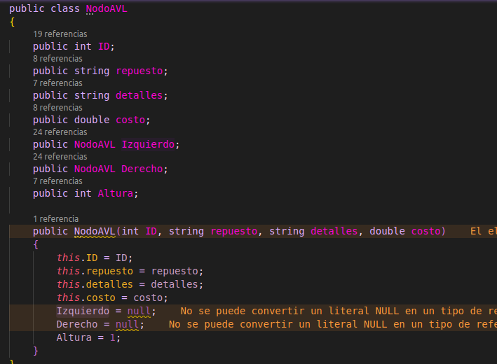
## Arbol B
en esta se creo una clase factura esta para poder almacenar los datos en listas las cuales iban a ser parte de los nodos de los arboles, es decir que esta estructura de datos es la unica la cual se creo una clase para su objeto aparte de su nodo.
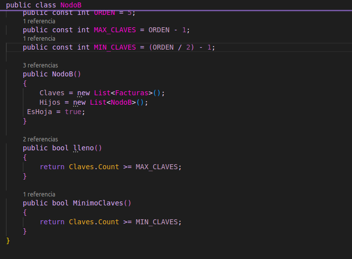

