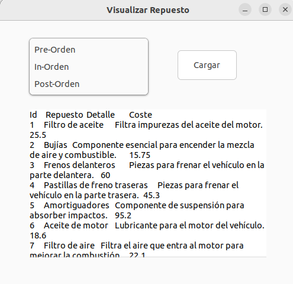
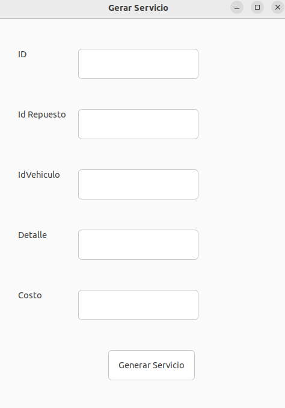

# Manual de Usuario
AutoGest Pro es un sistema integral de gestión diseñado específicamente para talleres de reparación de vehículos. Este software esta disenado para simplificar y optimizar todas las operaciones realizadas en el taller, desde el registro de vehículos hasta la gestión de servicios y el control de repuestos.

El sistema permite registrar cada vehículo que ingresa al taller, junto con los datos del propietario y las características del automóvil. Además, facilita la creación y seguimiento de servicios, asegurando que cada reparación se realice en el orden correcto y con los repuestos adecuados. Con su interfaz intuitiva y amigable, el sistema es fácil de usar y se adapta a las necesidades de talleres de cualquier tamaño.
# Administrador
## LOGIN 
En esta seccion del software sirve para ingresar sesion.

Como se ve en la imagen anterior esta consta de dos casillas marcadas las cuales le piden la informacion para iniciar sesion.

## Menu general

Al ingresar sesion como adminisrador este le abrira la siguiente ventana.

Como se puede observar en la imagen anterior se ve un menu con multiples opciones, cada opcion tiene un proposito distinto pero con el mismo fin, el cual es mantener un orden en su taller.

### Carga Masiva
En esta opcion le aparecera otra ventana con distintas opciones las cuales son: **Usuarios**, **Vehiculos** y **Repuestos**.

Al escoger una de estas opciones este lo llevara a su explorador de archivos donde debera escoger un archivo de formato .json
el cual debe de cumplir con los datos que pide cada uno respectivamente.

*ejemplo de archivo*

## Gestor de Entidades

En esta opcion le aparecera otra ventana con distintas opciones las cuales son: **Usuarios** y **Vehiculos** 

Al escoger una opcion se desplegara una ventana donde podra buscar, modificar y eliminar los distintos usuarios registrados anteriormente.

En la primera celda debera ingresar el ID de los datos del usuario o vehiculo que desee trabajar, luego debera dar click en el boton de buscar y este le mostrara los datos en la siguiente columna.

Para editar los datos solo debe cambiar los campos en la segunda columna para posteriormente presionar el boton de editar lo que cambiara los datos automaticamente.

para borrar los datos debe buscar los datos como se menciono anteriormente y dar click en el boton de eliminar y de ese modo se eliminara de manera automatica.

## Actualizacion de Repuestos
En esta opcion se desplegara una ventana que le permitira buscar y actualizar los datos de los repuestos, para ello debera ingresar el ID del repuesto en su casilla correspondiente y dar click en el boton de buscar de esa forma podra le apareceran los datos de forma automatica.

Para editar los datos debera cambiar las casillas de los datos que desee cambiar( no incluye el ID) para posteriormente darle click al boton de actualizar, de esa forma el programa actualizara los datos de forma automatica.

## Visualizacion de Repuestos
En esta opcion se desplegara una ventana donde podra escoger entre tres opciones, al escoger alguna opcion y presionar el boton de cargar esa le mostrara los datos de los repuestos. 

## Generar Servicio

Esta opcion desplegara una ventana que le permitira ingresar los datos requeridos para un servicio, luego de llenar las distintas casillas macadas debera de dar click en el boton de abajo lo que ingresara los datos de manera automatico.

al ingresar los datos se le abrira otra ventana para generar **facturas** esta debe de llenarse para poder llevar un registro de los movimientos del taller.

## Reportes
Al escoger esta opcion se generararn los reportes de todos los datos mencionados anteriormente, estos reportes se almacenaran en una carpeta llamada **reportes** donde se mostraran de forma grafica. 

# Usuario

## Menu Usuario

Al ingresar sesion como adminisrador este le abrira la siguiente ventana.

Como se puede observar en la imagen anterior se ve un menu con multiples opciones, cada opcion tiene un proposito distinto pero con el mismo fin, el cual es mantener un orden en su taller.

## Carga Manual de Vehiculos 

En esta opcion se le desplegara una ventana la cual le mostrara multiples cajas de texto senaladas con el dato que estos requiern, despues de llenar los distintos campos tendra que dar click en el boton inferior lo que cargara los datos en el software.

## Visualizar Servicios

En esta opcion se desplegara una ventana donde podra escoger entre tres opciones para poder visualizar los datos de los servicios, al escoger una opcion debera presionar en boton al lado, de esta forma se le mostrar la informacion en el cuadro de abajo.

## Visualizar Facturas

Se desplegara una ventana donde podra visualizar todas las facturas que se tiene, solo debera de presionar el boton de cargar para que esta le muestre los datos.

## Cancelar Factura

Esta opción le informará al sistema que el usuario ya pagó por el servicio y le debe mostrar los datos de la factura.

